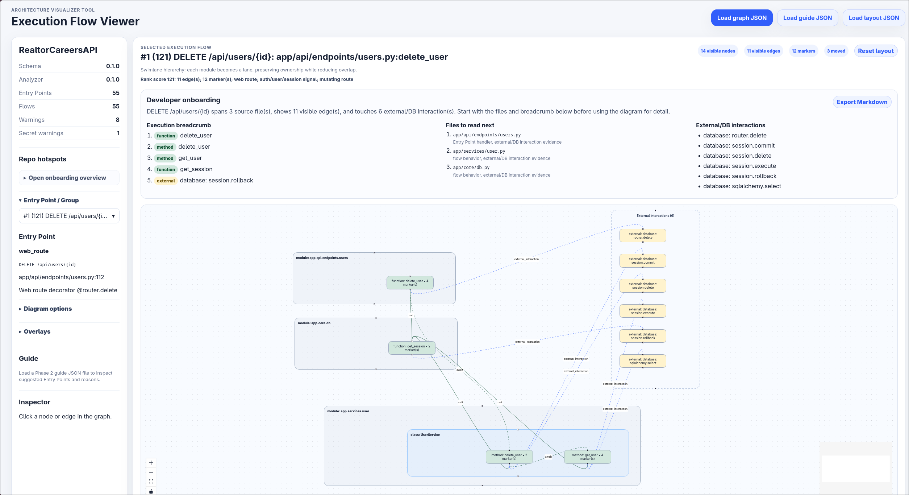
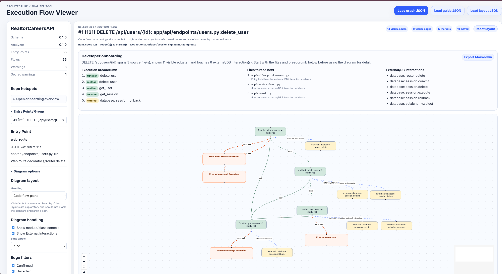

# AVT

AVT is an **Architecture Visualizer Tool** for helping Developers understand unfamiliar Python projects through **Execution Flow Graphs**.

Phase 1 focuses on a local/static workflow:

1. Run the Python analyzer on a local project.
2. Generate Execution Flow Graph JSON.
3. Open the JSON in the static/local viewer.
4. Explore Entry Points, calls, External Interactions, Flow Markers, warnings, and uncertainty.



Code flow example:



## Current status

AVT is converging on a **v1 onboarding workflow** for unfamiliar Python API/backend repositories:

- Generate a local Execution Flow Graph from a target repo.
- Open the graph in the static/local viewer.
- Start from ranked, likely-useful Entry Points.
- Inspect route/service/database/external interaction paths.
- Confirm/reject uncertain edges with an Analysis Overlay.
- Save presentation edits with a Layout Overlay.

Implemented core capabilities:

- Python analyzer CLI (`avt analyze`).
- FastAPI route discovery, router prefix composition, dependency flows, and framework hooks.
- Django/DRF route/action discovery for regression coverage.
- Entry Point discovery and manual Entry Point selection.
- Static call traversal with certainty annotations.
- External Interaction and likely ORM/database detection.
- Flow Markers for meaningful static behavior evidence.
- Analysis Overlay loading/export workflow for confirming/rejecting Uncertain Edges.
- Output-safety warnings for secret-looking literals and environment variable references.
- React Flow static/local viewer with v1 stable swimlane layout.
- Headless browser smoke tests, including a generic hiring-process demo API v1 graph smoke path.

## Monorepo layout

```text
apps/viewer/                    Static/local React viewer
packages/analyzer/              Python analyzer package and avt CLI
docs/                           Project docs, ADRs, validation notes
spikes/visualization-libraries/ Visualization library comparison spike
```

## Quickstart

### V1 demo: generic hiring-process demo API

The v1 demo target is a local fixture/check-out of a generic hiring-process API. This target is only a demo project used to validate AVT against a realistic FastAPI backend shape.

From the AVT repository root:

```sh
AVT_DEMO_API_TARGET=/absolute/path/to/hiring-process-demo-api \
  scripts/generate-v1-demo-api-graph.sh /tmp/avt-demo-api-v1.json
cd apps/viewer
npm install
npm run dev
```

Open the printed local URL and use **Load graph JSON** to select `/tmp/avt-demo-api-v1.json`.

### Analyze any local Python project

From the repository root:

```sh
uv run --project packages/analyzer avt analyze /path/to/project --no-timestamp --out /tmp/avt-graph.json
python -m json.tool /tmp/avt-graph.json >/dev/null
```

Folder output mode writes all parsing results:

```sh
uv run --project packages/analyzer avt analyze --input /absolute/path/to/repo --output avt-output
```

Useful variants:

```sh
# Generate the v1 generic hiring-process demo API validation graph and run sanity checks
AVT_DEMO_API_TARGET=/absolute/path/to/hiring-process-demo-api \
  scripts/generate-v1-demo-api-graph.sh /tmp/avt-demo-api-v1.json

# List discovered Entry Points only
uv run --project packages/analyzer avt analyze . --list-entrypoints

# Analyze a manual Entry Point
uv run --project packages/analyzer avt analyze . \
  --entry packages/analyzer/src/avt_analyzer/cli.py:analyze_command \
  --out /tmp/avt-graph.json

# Include tests in scanning
uv run --project packages/analyzer avt analyze . --include-tests --out /tmp/avt-graph.json
```

### 2. Run the viewer

```sh
cd apps/viewer
npm install
npm run dev
```

Open the printed local URL and use **Load graph JSON** to select the graph file.

For a production build:

```sh
cd apps/viewer
npm run build
npm run preview
```

## V1 support and limitations

V1 is designed for local/static onboarding of Python backend/API projects.

Supported well enough for v1:

- FastAPI routes, router prefixes, dependencies, and framework hooks;
- Django REST Framework `@api_view` / `@action` discovery for regression coverage;
- route/service/helper call paths where static resolution is possible;
- likely ORM/database and external interactions;
- uncertainty and human correction through Analysis Overlay.

Known limitations:

- whole-program call graphs are approximate;
- dynamic dispatch, dependency injection, and framework magic may produce uncertain or missing edges;
- likely ORM/external heuristics can be noisy and should be corrected with overlays when needed;
- broad multi-language support is future work, documented in `docs/future-lsp-multilanguage-plan.md`;
- target projects are read-only inputs: AVT does not modify source repositories during analysis.

## Analyzer CLI

Command:

```sh
avt analyze [path] [options]
```

Common usage through this monorepo:

```sh
uv run --project packages/analyzer avt analyze <path> [options]
```

Options summary:

| Option | Value | Description |
| --- | --- | --- |
| `<path>` | directory | Project directory to analyze. Must exist and be a directory. |
| `--out` | path | Output graph JSON file path. Defaults to `avt-graph.json` in the current directory when `--output` is omitted. |
| `--input` | absolute path | Absolute project directory to analyze; alternative to positional `<path>`. |
| `--output` | folder path | Folder for all parsing results: `graph.json`, `summary.json`, `warnings.json`, `entrypoints.json`. Cannot be combined with `--out`. |
| `--entry` | `path.py:qualified.name` | Manual Entry Point. May be passed multiple times. |
| `--list-entrypoints` | flag | Print discovered Entry Points and summary without writing graph JSON. |
| `--overlay` | path | Analysis Overlay JSON path. Defaults to `<project>/.avt/overlay.json` when present. |
| `--no-timestamp` | flag | Omit `metadata.generated_at` for reproducible output. |
| `--include-tests` | flag | Include tests that are excluded by default. |
| `--max-depth` | integer | Maximum call traversal depth. Defaults to `6`. |

See `packages/analyzer/README.md` for full analyzer documentation.

## Viewer

The viewer is a static/local web app. It does not require a backend and does not upload graph files.

Current UI includes:

- graph metadata summary;
- Entry Point selector;
- selected Execution Flow rendering with React Flow;
- diagram layout options: nested ownership map, swimlane hierarchy, outline + focused graph, layered flow, circular, and compact grid;
- diagram handling options for hierarchy context, External Interactions, and edge labels;
- hierarchy context nodes;
- node/edge inspector;
- Flow Marker details;
- External Interaction and certainty styling;
- filters for confirmed, uncertain, and rejected edges.

See `apps/viewer/README.md` for full viewer documentation.

## Execution Flow Graph contents

Graph JSON includes:

- `metadata` — schema/analyzer/project metadata;
- `entry_points` — discovered and manual Entry Points;
- `flows` — selected-flow node/edge/marker references;
- `nodes` — modules, classes, functions, methods, and External Interaction nodes;
- `edges` — calls, awaits, and External Interactions;
- `markers` — async, conditional, loop, raise, and return evidence;
- `warnings` — parse/read/safety/overlay warnings.

AVT uses relative paths and does not embed source snippets or full source code in graph JSON.

## Analysis Overlay

Analysis Overlay files let Developers resolve Uncertain Edges without changing source code.

Example:

```json
{
  "edge_resolutions": [
    {"edge_id": "edge:...", "certainty": "confirmed"},
    {"edge_id": "edge:...", "certainty": "rejected"}
  ]
}
```

Use an explicit overlay:

```sh
uv run --project packages/analyzer avt analyze . --overlay .avt/overlay.json
```

Or place it at:

```text
<project>/.avt/overlay.json
```

Overlay resolutions currently apply only to uncertain edges.

## Safety model

AVT is not a security scanner. The safety rules protect AVT output:

- secret-looking literal values are not emitted;
- warnings mention safe identifiers and source locations only;
- environment variable names may be included, values are not;
- docstrings are skipped during safety scanning;
- source snippets/full source are not embedded in graph JSON.

## Development verification

Analyzer:

```sh
uv run --project packages/analyzer python -m unittest discover packages/analyzer/tests
uv run --project packages/analyzer avt analyze . --no-timestamp --out /tmp/avt-graph.json
python -m json.tool /tmp/avt-graph.json >/dev/null
```

Viewer:

```sh
cd apps/viewer
npm install
npm run build
npm run smoke
```

Full v1 browser smoke with generic hiring-process demo API graph:

```sh
AVT_DEMO_API_TARGET=/absolute/path/to/hiring-process-demo-api \
  scripts/smoke-v1-demo-api-viewer.sh /tmp/avt-demo-api-v1.json
```

## Documentation

- `CONTEXT.md` — project language/glossary.
- `docs/restart-plan.md` — Phase 1 restart plan.
- `docs/v1-onboarding-demo.md` — v1 onboarding workflow and acceptance criteria.
- `docs/phase2-llm-guide-plan.md` — Phase 2 LLM Guide plan.
- `docs/analysis-overlay.md` — Analysis Overlay schema and confirm/reject round trip.
- `docs/layout-overlay.md` — viewer layout overlay schema.
- `docs/future-lsp-multilanguage-plan.md` — future LSP-assisted multi-language architecture plan.
- `docs/experimental-code-flow-layout.md` — experimental Code Flow layout and trigger-condition outcome design.
- `docs/development.md` — local development commands.
- `docs/adr/` — architecture decisions.
- `docs/validation/` — validation notes and QA artifacts, including Phase 2 Guide validation.
